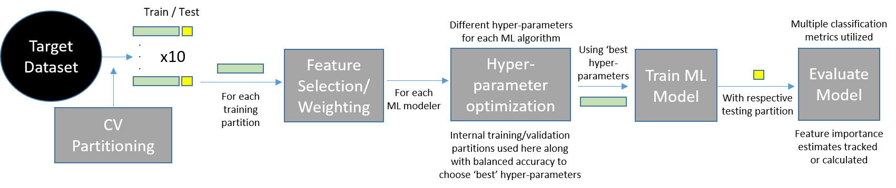

# pancreatic_cancer_ml_pipeline

This study is an exploration of various machine learning models (and the statistical comparison of these models) as they apply to patient health data with varying degrees and types of bias. The three datasets utilized in this analysis were obtained from the Prostrate, Lung, Colorectal, and Ovarian (PLCO) Cancer Trial; in this study, we work with pancreatic cancer data obtained as a corollary from the trial. The datasets each included health records for both cases (patients who had pancreatic cancer) and controls (patients who did not have pancreatic cancer).

The primary research objectives of this study are to develop a comprehensive machine learning pipeline encompassing a broad spectrum of models to be compared across datasets, as well as to assess various contributors of bias between datasets and how they can be handled in machine learning population-based cohort studies. 

This repository contains the Jupyter notebooks, and supplemental materials for our research paper on assessing machine learning bias in cohort population studies.

&nbsp;

Included in the repository are the following:

- **"Pipeline.png"** - figure containing the basic structure of the ML analysis pipeline that was implemented
- **“Supplementary Table 1.xlsx”** – offers baseline information on the composition of the datasets in this study
- **“Supplementary materials.pdf”** – document enumerating various supplementary materials, tables, and figures that pair with our publication
- **“dX_feature_importance_viz.ipynb”** – Jupyter notebook for generating feature importance plots (individual and compound bar plots) for Dataset X (1, 2, or 3); also available as an html file
- **“dX_ml_pipeline.ipynb”** – Jupyter notebook for running the ML analysis pipeline on Dataset X (1, 2, or 3); also available as an html file
-	**“figures.zip”** – zipped folder of .png files containing the original figure files that were generated during analysis
-	**“metric_pub_report.ipynb”** – Jupyter notebook summarizing and comparing performance across models within each dataset (avg./sd, boxplots, and non-parametric statistical comparisons); also available as an html file
-	**“results.zip”** – zipped folder of Excel files containing the raw results (various metrics used) from the ML models in the pipeline for each dataset

&nbsp;

The general framework implemented for the analysis pipeline is depicted in the figure below:

For each dataset, the data was first partitioned into 10 cross-validation training and testing datasets. Each of these 10 training sets underwent feature selection (MultiSURF and mutual information algorithms were implemented) in order to identify and filter out the most important features to be included in the analysis. Following this, the hyperparameters were tuned for each model and training set (models tested include: linear regression, decision tree, random forest, neural networks, XGBoost, support-vector machine, naïve Bayes, & learning classifier systems). These optimal hyperparameters were then fed into their respective models and used to train the training dataset for which they were optimized. Finally, the testing dataset corresponding to each training dataset was used to test each trained model and obtain various classification metrics on which to evaluate and compare the models.

The *metric_pub_report.ipynb* notebook includes numerous statistical analyses of the classification results for each dataset obtained from the analysis pipeline. Boxplots of the balanced accuracies for each model in each dataset were generated, and the non-parametric statistical comparison tests performed for each dataset were the Kruskal-Wallis and Mann-Whitney U tests. The Kruskal-Wallis test was implemented for each dataset to sweep for statistically significant differences between the balanced accuracies for all models tested. The Mann-Whitney U test was used to carry out pairwise comparisons between models for each dataset.

Lastly, various methods and plots were utilized to further obtain, examine, and compare feature importance scores per dataset. Boxplots were generated using the MultiSURF importance scores obtained during feature selection. Consequently, 4 separate compound feature importance bar plots were generated using the scores generated by each model during analysis. The first of these simply plots the normalized scores for each feature (see *"Compound Feature Importance Plot (Normalized only)"* in feature importance notebooks). The second plot displays the normalized feature importance scores weighted fractionally and again stacked and color-coded by model (see *"Compound Feature Importance Plot (Normalized + Fraction Adjustment)"* in feature importance notebooks). The third figure plots the normalized feature importance scores for each model weighted by their balanced accuracies, wherein the contribution of the model's score to the stacked bar for each feature was 0 when the balanced accuracy was <= 0.5 and 1 when the balanced accuracy was 1 (normalized for all values in between) (see *"Compound Feature Importance Plot (Normalized + Perf. Weight Adjustment)"* in feature importance notebooks). The final plot shows the feature importance scores obtained via a combination of the latter two approaches described. In this plot, the normalize scores are weighted both by balanced accuracy (vis-à-vis the other models) and fractionally (vis-à-vis the other features) (see *"Compound Feature Importance Plot (Normalized + Frac. + Perf. Weight Adjustment)"* in feature importance notebooks).

&nbsp;
&nbsp;

*
This project was led by **Ryan Urbanowicz** and **Shannon Lynch** of the University of Pennsylvania and the Fox Chase Cancer Center, respectively.
*
*
**Pranshu Suri** and **Yuhan Cui**, of the University of Pennsylvania, were contributors to assembling this pipeline.
*
